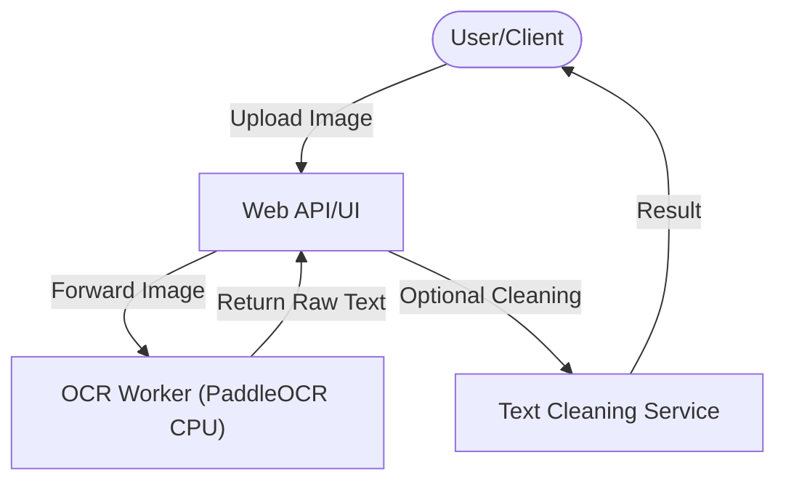

# OCR Worker & Environment

Project ini berfokus pada penyediaan **OCR Environment** yang siap pakai dan ringan untuk mengekstrak teks dari gambar atau dokumen. Inti dari sistem ini adalah **OCR Worker**, sebuah service mandiri yang menangani proses berat Optical Character Recognition secara efisien.

---

## Apa itu OCR Worker?

**OCR Worker** adalah microservice berbasis Python (FastAPI) yang dirancang khusus untuk menjalankan engine [PaddleOCR](https://github.com/PaddlePaddle/PaddleOCR). 

- **State-of-the-art Accuracy**: Menggunakan model PaddleOCR yang terbukti akurat untuk berbagai jenis font dan tata letak.
- **CPU Optimized**: Dikonfigurasi khusus untuk berjalan optimal di lingkungan CPU (tidak memerlukan GPU/NVIDIA drivers), sehingga mudah di-deploy di VPS standar atau laptop.
- **Simple Interface**: Menyediakan endpoint API sederhana untuk mengirim gambar dan menerima teks mentah (raw text) secara instan.

## Konsep OCR Environment

Konsep **OCR Environment** dalam proyek ini adalah menciptakan lingkungan yang terisolasi dan *pre-configured*. Anda tidak perlu pusing menginstall dependensi sistem yang kompleks (tesseract, opencv, paddle-binary, dll) di mesin lokal Anda.

### Bagaimana cara menggunakannya?

1.  **Stand-alone Engine**: Gunakan worker ini sebagai mesin OCR pusat untuk berbagai aplikasi Anda yang lain. Cukup panggil API-nya.
2.  **Scalable Node**: Dalam arsitektur yang lebih besar, Anda bisa menjalankan banyak instance worker ini di belakang load balancer untuk memproses ribuan dokumen secara paralel.
3.  **Pipeline Component**: Integrasikan worker ini ke dalam pipeline pemrosesan data (seperti proyek `notabypass` ini yang menggabungkan OCR dengan langkah pembersihan teks otomatis).

---

## Struktur Proyek

- [ocr-worker/](ocr-worker/) — **Inti Proyek**: Kode sumber worker Python dan Dockerfile.
- [web/](web/) — Antarmuka web (Next.js) sebagai contoh implementasi pemanggilan worker.
- [docker-compose.yml](docker-compose.yml) — Orkestrasi untuk menjalankan seluruh lingkungan dalam satu perintah.

---

## Quick Start (Running the Environment)

### 1. Menggunakan Docker (Direkomendasikan)
Ini adalah cara tercepat untuk mendapatkan OCR Environment yang fungsional tanpa menginstall Python secara manual.

```bash
docker-compose up --build
```
Worker akan berjalan di `http://localhost:8000`.

### 2. Pengembangan Lokal (Tanpa Docker)
Jika ingin menjalankan langsung di sistem:
```bash
cd ocr-worker
python -m venv .venv
source .venv/bin/activate # atau .venv\Scripts\activate di Windows
pip install -r requirements.txt
python main.py
```

---

## Integrasi & Arsitektur

Worker ini dirancang untuk menjadi bagian dari pipeline yang lebih luas:



---

## Penggunaan API Worker

Setelah worker berjalan, Anda dapat berinteraksi langsung melalui endpoint:

### POST `/process`
Unggah gambar untuk diproses oleh engine OCR.

**Request (cURL):**
```bash
curl -X POST http://localhost:8000/process \
  -F "file=@/path/to/kuitansi.jpg"
```

**Penjelasan Response:**

| Field | Tipe Data | Deskripsi |
|---|---|---|
| `status` | String | Status akhir proses (`success` atau `error`). |
| `filename` | String | Nama file gambar yang diproses. |
| `raw_text` | String | Hasil ekstraksi teks mentah yang digabungkan per baris dengan spasi. |

**Contoh Response (Success):**
```json
{
  "status": "success",
  "filename": "kuitansi.jpg",
  "raw_text": "TOKO GROSIR JAYA ... TOTAL RP 50.000"
}
```

**Contoh Response (Error):**
```json
{
  "status": "error",
  "message": "File format not supported"
}
```

*Selengkapnya lihat [ocr-worker/api_reference.md](ocr-worker/api_reference.md).*

---

## Tips Produksi
- **Isolation**: Selalu jalankan di dalam container untuk memastikan konsistensi library OpenCV dan Paddle.
- **Resource Limit**: Berikan limit CPU yang cukup pada container karena OCR tetap memakan resource meskipun tanpa GPU.
- **Volume Mapping**: Mapping folder `data` untuk melihat riwayat gambar yang diunggah jika diperlukan untuk debugging.
